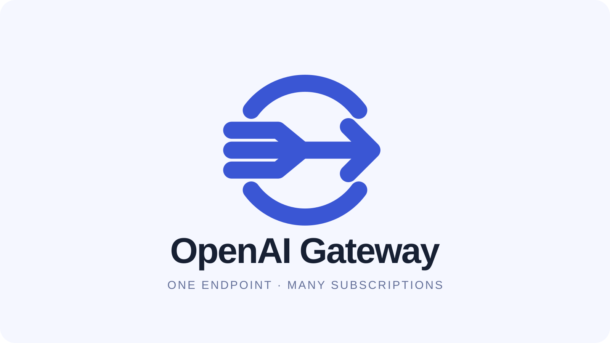
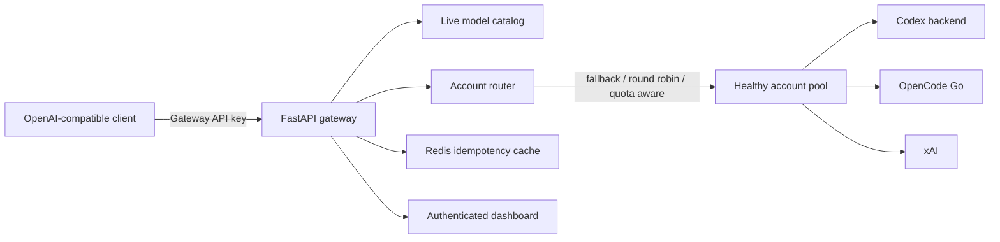

<div align="center">
  

  **One OpenAI-compatible endpoint for Codex, OpenCode Go, and xAI.**
</div>

## Overview

OpenAI Gateway lets applications use Codex subscription credentials through a
familiar API surface. It discovers the models available to each configured
account, refreshes OAuth tokens, routes requests across healthy accounts, and
translates Chat Completions requests to the upstream Responses protocol.

The gateway was originally built for
[Spores](https://github.com/hetsaraiya/spores), where disposable coding
sandboxes need one stable endpoint without receiving every upstream credential.
It now also supports optional OpenCode Go subscription keys and xAI inference
API keys.

> Use only accounts, subscriptions, and workloads that you are authorized to
> operate. Upstream APIs and account terms may change independently of this
> project.

## Architecture



## Features

- OpenAI-compatible `chat/completions`, `responses`, and model-list endpoints.
- Anthropic-compatible `messages` requests for supported OpenCode Go models.
- xAI Chat Completions and Responses with live language-model discovery.
- xAI automatic prompt caching with conversation-key forwarding.
- Multiple Codex accounts loaded from individual credential files.
- Automatic OAuth refresh with refreshed credentials persisted to disk.
- `fallback`, `round_robin`, and `quota_aware` routing strategies.
- Temporary account cooldown after rate limits and bounded retry attempts.
- Redis-backed `Idempotency-Key` deduplication to prevent duplicate work.
- Streaming and non-streaming response translation.
- Device-login and credential-management endpoints for adding accounts.
- An authenticated dashboard for inspecting providers, models, and health.
- Structured request logging with per-request identifiers.

## API surface

| Method | Endpoint | Purpose |
| --- | --- | --- |
| `GET` | `/healthz` | Liveness and dependency health |
| `GET` | `/v1/models` | Models available across configured providers |
| `POST` | `/v1/chat/completions` | OpenAI-compatible chat completions |
| `POST` | `/v1/responses` | Responses API passthrough |
| `POST` | `/v1/messages` | Anthropic-compatible OpenCode Go requests |
| `GET` | `/` | Public landing page |
| `GET` | `/dashboard` | Browser-based gateway dashboard |
| `GET` | `/admin/status` | Account and routing status |

Except for `/healthz`, the landing page, and the dashboard shell, gateway and
administration routes require the configured master key. The landing page and
the console are the same bundle: `/` opens the marketing page, `/dashboard`
opens the key prompt directly, and the console's own views live behind
`#overview` / `#accounts`.

## Quick start

### Prerequisites

- Python 3.12 or newer
- [uv](https://docs.astral.sh/uv/)
- Redis
- The [Codex CLI](https://github.com/openai/codex) for account sign-in

### 1. Install

```bash
git clone https://github.com/hetsaraiya/openai-gateway.git
cd openai-gateway
uv sync
```

### 2. Add an account

Sign in with Codex, then copy its generated credentials into the gateway. Use a
different JSON filename for each additional account.

```bash
codex login
mkdir -p auth
cp ~/.codex/auth.json auth/main.json
```

The `auth/` directory is ignored by Git. Keep it writable and persistent so the
gateway can save refreshed tokens.

### 3. Configure the gateway

```bash
cp .env.example .env
```

Set `GATEWAY_API_KEY` in `.env` to a long, random secret. The other settings
have development-friendly defaults.

### 4. Start Redis and the API

```bash
docker run -d --name openai-gateway-redis -p 6379:6379 redis:7-alpine
uv run uvicorn app.main:app --reload
```

The gateway listens on `http://localhost:8000`.

```bash
curl http://localhost:8000/healthz
```

## Client example

Point any OpenAI-compatible SDK at the gateway's `/v1` base URL:

```python
from openai import OpenAI

client = OpenAI(
    base_url="http://localhost:8000/v1",
    api_key="your-gateway-api-key",
)

response = client.chat.completions.create(
    model="gpt-5.1-codex",
    messages=[{"role": "user", "content": "Hello from the gateway"}],
)

print(response.choices[0].message.content)
```

Query `GET /v1/models` to use model IDs actually available to the configured
accounts. OpenCode Go models use the `opencode-go/<model-id>` prefix at the
gateway boundary; xAI models use `xai/<model-id>` and Cursor subscription
models use `cursor/<model-id>`.

### xAI prompt caching

xAI performs prompt caching automatically for matching prompt prefixes. For
reliable cache affinity, send a stable `x-grok-conv-id` header with Chat
Completions requests:

```bash
curl http://localhost:8000/v1/chat/completions \
  -H "Authorization: Bearer $GATEWAY_API_KEY" \
  -H "Content-Type: application/json" \
  -H "x-grok-conv-id: conversation-123" \
  -d '{"model":"xai/grok-4.5","messages":[{"role":"user","content":"Hello"}]}'
```

For `/v1/responses`, include `"prompt_cache_key": "conversation-123"` in the
request body. The gateway maps it to the same stable Grok conversation header
and preserves cached-token usage fields. xAI accounts authenticate through the
Grok subscription OAuth device flow; developer-console API keys are not used.

## Configuration

| Variable | Default | Purpose |
| --- | --- | --- |
| `GATEWAY_API_KEY` | required | Master key presented by clients |
| `AUTH_DIR` | `auth` | Directory containing account credential JSON files |
| `REDIS_URL` | `redis://localhost:6379/0` | Redis connection URL |
| `ROUTING_STRATEGY` | `fallback` | `fallback`, `round_robin`, or `quota_aware` |
| `RATE_LIMIT_COOLDOWN` | `60` | Seconds to bench a rate-limited account |
| `MAX_ACCOUNT_ATTEMPTS` | `3` | Maximum accounts tried for one request |
| `REQUEST_TIMEOUT` | `600` | Upstream timeout in seconds |
| `DEFAULT_MODEL` | empty | Model used when a chat request omits one |
| `DEDUP_ENABLED` | `true` | Enable idempotency-key deduplication |
| `DEDUP_TTL` | `600` | Deduplicated response lifetime in seconds |
| `OPENCODE_GO_API_KEYS` | empty | Optional comma-separated subscription keys |
| `XAI_BASE_URL` | `https://cli-chat-proxy.grok.com/v1` | Grok subscription inference base URL |
| `XAI_OAUTH_ISSUER` | `https://auth.x.ai` | xAI OAuth issuer |
| `XAI_OAUTH_CLIENT_ID` | Grok CLI public client | OAuth device-flow client |
| `GROK_CLIENT_VERSION` | current supported version | Version identity sent to xAI services |
| `CURSOR_BINARY` | `cursor-agent` | Official Cursor Agent CLI used for subscription login and headless inference |

See [`.env.example`](./.env.example) for upstream URLs, OAuth behavior, catalog
caching, and every optional setting.

### Routing strategies

- `fallback` walks the account list in priority order until one succeeds.
- `round_robin` spreads new requests across currently healthy accounts.
- `quota_aware` prefers the account with the most usable quota information.

When an upstream returns a rate limit, the account enters a temporary cooldown
and the request may be retried on another account up to
`MAX_ACCOUNT_ATTEMPTS`.

## Docker Compose

With `.env` configured and credentials stored in `auth/`:

```bash
sudo chown -R 10001:10001 auth
chmod 700 auth
docker compose up --build
```

The Compose stack starts both Redis and the gateway on port `8000`.

## Development

Run the test suite:

```bash
uv run pytest
```

Key directories:

```text
.
├── app/         API, routing, credentials, translation, and observability
├── auth/        Runtime credential files; ignored by Git
├── tests/       Async unit and integration tests
├── web/         Dashboard source and brand assets
└── Dockerfile   Production container image
```

## Security notes

- Never commit `.env`, account JSON, subscription keys, or access tokens.
- Use a unique, high-entropy gateway key and terminate TLS at the deployment
  boundary.
- Restrict the dashboard and administration routes to trusted operators.
- Mount `AUTH_DIR` as a private persistent volume with narrow permissions.
- Treat the gateway as privileged infrastructure: its master key can reach
  every configured account.
